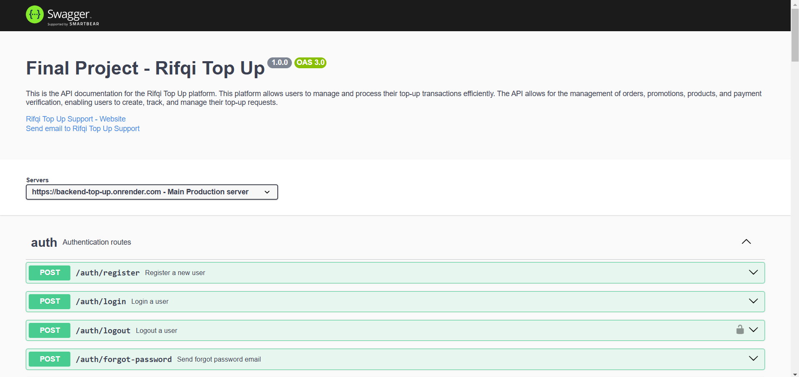
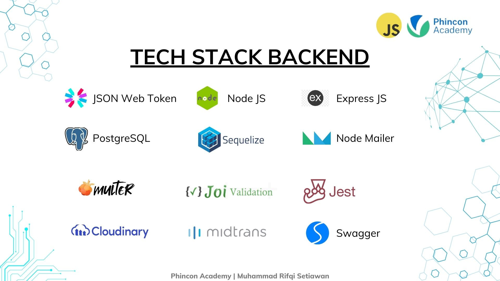

# 🎮 Rifqi Top Up Backend 🎮

Backend project for Rifqi Top Up service, providing functionalities for user management, product handling, orders, and more. Built using Node.js and Express.js with various integrations for authentication, payments, and media handling.

## 🧾 Table of Contents

- [📝 Api Documentation Preview](#-api-documentation-preview)
- [🧑🏻‍💻 Author](#-author)
- [🛠️ Tech Stack](#️-tech-stack)

  - [Core Frameworks & Language](#core-frameworks--language)
  - [Authentication & Security](#authentication--security)
  - [Database](#database)
  - [Payment Gateway](#payment-gateway)
  - [Media Storage](#media-storage)
  - [Testing & Utilities](#testing--utilities)

- [🌐 Environment Variables](#environment-variables)
- [🚀 Getting Started](#getting-started)
- [🤝 Contribution](#contribution)
- [🔧 Frontend Repository](#frontend-repository)
- [📝 License](#license)

## 📝 Preview of the API Documentation



## 🧑🏻‍💻 Author

- [@Muhammad Rifqi Setiawan](https://github.com/rifqi142)

## ⚡️ Tech Stack



### Core Frameworks & Language

- **Node.js**: Backend runtime environment for building fast, scalable applications.
- **Express.js**: Web framework for building APIs in Node.js, simplifies routing and middleware integration.

### Authentication & Security

- **JWT (JSON Web Tokens)**: Secure authentication system for handling user login and verification.
- **bcrypt**: Library for hashing passwords before storing them in the database to ensure security.
- **Joi**: Schema validation for request data to ensure correct and secure data handling.

### Database

- **Sequelize ORM**: Object-relational mapping (ORM) tool for PostgreSQL, simplifying database interaction with easy-to-use models and queries.
- **PostgreSQL**: Relational database for storing user data, product details, and transaction records.

### Payment Gateway

- **Midtrans**: Payment gateway integration for handling secure transactions and order payments.

### Media Storage

- **Cloudinary**: A media storage solution for handling file uploads such as images and videos, and managing media assets in the cloud.

### Testing & Utilities

- **Jest & Supertest**: Jest is a testing framework for running unit tests, while Supertest is used for testing HTTP APIs to ensure endpoints are functioning as expected.
- **Swagger**: Tool for API documentation, making it easier for developers to test and interact with the API.

## 🧩 Features

- User registration, login, and Google authentication.
- CRUD operations for users, products, and categories.
- Payment processing using Midtrans.
- File upload support with Cloudinary.
- Email verification and password reset.
- Comprehensive admin statistics and reports.
- Fully tested APIs with Jest and Supertest.

## 🌐 Environment Variables

This project uses the following environment variables:

- DB_HOST: Database host (e.g., localhost).
- DB_PORT: Database port (e.g., 5432).
- DB_NAME: Name of the database.
- DB_USER: Database username.
- DB_PASSWORD: Database password.
- etc.

you can see the full list of environment variables in the `.env.example` file.

---

## 🚀 Usage

Use an API client like Postman or curl to test the API. Example requests and sample data are described below.

### 🎯 API Endpoints

### 🛠️ Admin (`/admin`)

| Method | Endpoint                           | Description                           |
| ------ | ---------------------------------- | ------------------------------------- |
| GET    | /admin/get-user-count              | Retrieve total user count             |
| GET    | /admin/get-product-count           | Retrieve total product count          |
| GET    | /admin/get-order-count             | Retrieve total order count            |
| GET    | /admin/get-total-amount            | Retrieve total transaction amount     |
| GET    | /admin/get-order-today             | Retrieve today's orders               |
| GET    | /admin/get-all-order               | Retrieve all orders                   |
| POST   | /admin/create-user                 | Create a new user                     |
| GET    | /admin/get-all-user                | Retrieve all users                    |
| PUT    | /admin/update-user/:userId         | Update a user by ID                   |
| DELETE | /admin/set-inactive-user/:userId   | Set a user to inactive                |
| PUT    | /admin/set-active-user/:userId     | Activate an inactive user             |
| GET    | /admin/get-name-category           | Retrieve all product categories       |
| POST   | /admin/create-product              | Create a new product                  |
| PUT    | /admin/update-product/:productId   | Update a product by ID                |
| DELETE | /admin/delete-product/:productId   | Delete a product by ID                |
| GET    | /admin/get-all-category            | Retrieve all categories               |
| POST   | /admin/create-category             | Create a new category (with images)   |
| PUT    | /admin/update-category/:categoryId | Update a category by ID (with images) |
| DELETE | /admin/delete-category/:categoryId | Delete a category by ID               |

### 🛒 Products (`/products`)

| Method | Endpoint                                 | Description            |
| ------ | ---------------------------------------- | ---------------------- |
| GET    | /products/get-all-product                | Retrieve all products  |
| GET    | /products/get-product-detail/:categoryId | Retrieve product by ID |

### 📂 Categories (`/category`)

| Method | Endpoint                                    | Description                       |
| ------ | ------------------------------------------- | --------------------------------- |
| GET    | /category/get-category-detail/:categoryCode | Retrieve category details by code |
| GET    | /category/search-category                   | Search categories                 |

### 🔐 Authentication (`/auth`)

| Method | Endpoint                      | Description                     |
| ------ | ----------------------------- | ------------------------------- |
| POST   | /auth/register                | Register a new user             |
| POST   | /auth/login                   | Login with credentials          |
| POST   | /auth/logout                  | Logout a user session           |
| POST   | /auth/forgot-password         | Request a password reset        |
| PUT    | /auth/update-reset-password   | Update a forgotten password     |
| POST   | /auth/send-email-verification | Send an email verification link |
| GET    | /auth/verify-email            | Verify a user's email           |
| POST   | /auth/google-login            | Login using Google credentials  |

### 🧾 Orders (`/order`)

| Method | Endpoint                             | Description                   |
| ------ | ------------------------------------ | ----------------------------- |
| POST   | /order/create-order-snap-transaction | Create an order with Midtrans |
| GET    | /order/verify-payment/:orderId       | Verify payment status         |
| POST   | /order/cancel-order/:orderId         | Cancel an order               |
| GET    | /order/get-all-order                 | Retrieve all orders           |
| GET    | /order/get-all-order/:userId         | Retrieve orders by user ID    |

### 🎁 Promotions (`/promotion`)

| Method | Endpoint           | Description             |
| ------ | ------------------ | ----------------------- |
| GET    | /get-all-promotion | Retrieve all promotions |

## 🎲 Dependencies

- **bcrypt**: Hashing passwords.
- **joi**: Schema validation.
- **cookie-parser**: Parse cookies in requests.
- **cors**: Enable CORS.
- **jsonwebtoken**: Generate and verify JWTs.
- **nodemailer**: Send email notifications.
- **swagger**: API documentation.
- **supertest**: HTTP assertions for tests.
- **jest**: Unit testing framework.
- **firebase**: Google authentication integration.
- **sequelize**: ORM for PostgreSQL.
- **multer**: File upload middleware.

## 🚀Testing

- **Frameworks**: Jest and Supertest are used for writing and running tests.
- **Coverage**: Ensure endpoints and business logic are thoroughly tested.

## 🛠 Installation

1. **Clone the repository**:
   ```bash
   git clone https://github.com/rifqi142/backend-top-up
   cd backend-top-up
   ```
2. **Install the dependencies**:
   ```bash
    npm install
   ```
3. **Set up the environment variables**:
   - Create a `.env` file in the root directory.
   - Copy the contents of `.env.example` into `.env`.
   - Modify the environment variables as needed.
   ```bash
   DB_HOST=your_db_host
   DB_PORT=your_db_port
   DB_NAME=your_db_name
   DB_USER=your_db_user
   DB_PASSWORD=your_db_password
   etc.
   ```
   you can see the full list of environment variables in the `.env.example` file.
4. **Run the migrations, and seeders for data**:
   ```bash
   npm run migration:up
   npm run seed:all
   ```
5. **Start the server**:
   ```bash
    npm start
   ```
6. **Access the API**:
   - Open your browser and navigate to `http://localhost:8080/api-docs` to view the Swagger UI documentation.

---

## 📂 Contribution

1. Fork the repository.
2. Create a new branch for your feature or bug fix.
3. Commit your changes and push them.
4. Open a pull request.

## 🔧 Frontend Repository

The frontend repository for this project can be found [here](https://github.com/rifqi142/frontend-top-up)

## 📝 License

This project is licensed under the MIT License - see the [LICENSE](LICENSE) file for details.
